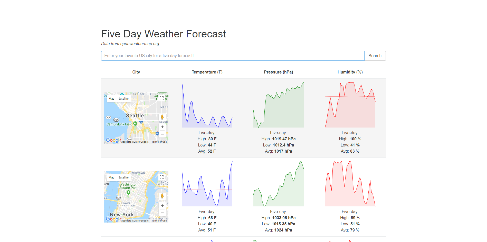

# Five Day Weather Forecast
## Single page React/Redux app with weather data from openweathermap.org API and maps via the Google Maps API



## About

 When you search for a city, the fetchWeather action makes an api call to openweathermap.org API via axios and then passes the request promise to the reducer.  The redux-promise npm package in the reducer pulls the weather data from the promise and updates the state with the new data.  This info is then passed to the WeatherList component and the necessary data is extracted in order to display the map for each city (via the Google Maps API in the google_map.js component) along with the upcoming weather data that is passed down to the chart.js component (charts are generated using the Sparklines npm package).


## Getting Started

To use the app locally, follow these steps in GitBash/Terminal:

```
> git clone https://github.com/D-Molloy/react-redux-weather.git
> cd react-redux-weather
> npm install
> npm start
> If the app doesn't open automatically, visit http://localhost:8080/webpack-dev-server/
```

